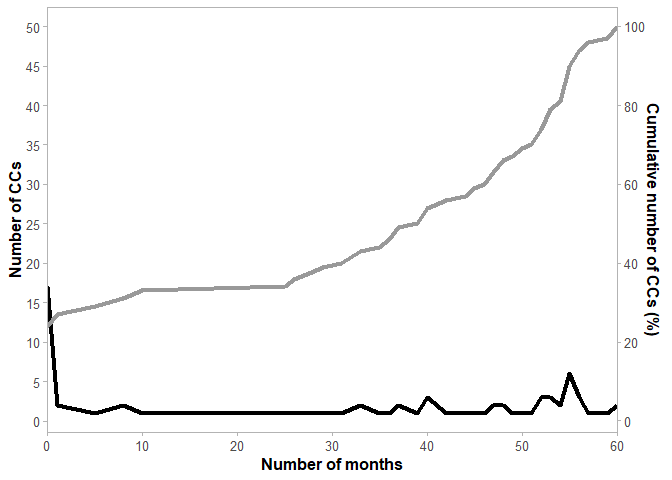

# Analysing illicit drug networks

Using relational, temporal, spatial and other quantitative analyses to
generate knowledge regarding organised crime activity

## Table of contents

  - [Code
    overview](https://github.com/PopovicAna/Analysing-illicit-drug-networks#Code-overview)
  - [Scope](https://github.com/PopovicAna/Analysing-illicit-drug-networks#Scope)
  - [Usage](https://github.com/PopovicAna/Analysing-illicit-drug-networks#Usage)
      - [Building
        networks](https://github.com/PopovicAna/Analysing-illicit-drug-networks#building-illicit-drug-networks)
      - [Relational
        analysis](https://github.com/PopovicAna/Analysing-illicit-drug-networks#Relational-analysis)
      - [Temporal
        analysis](https://github.com/PopovicAna/Analysing-illicit-drug-networks#Temporal-analysis)
      - [Spatial
        analysis](https://github.com/PopovicAna/Analysing-illicit-drug-networks#Spatial-analysis)
      - [Quantitative
        analysis](https://github.com/PopovicAna/Analysing-illicit-drug-networks#Quantitative-analysis)
  - [Author](https://github.com/PopovicAna/Analysing-illicit-drug-networks#Author)
  - [Acknowledgements](https://github.com/PopovicAna/Analysing-illicit-drug-networks#Acknowledgements)
  - [References](https://github.com/PopovicAna/Analysing-illicit-drug-networks#References)

## Code overview

The following code reads in simulated data (*original data cannot be
disseminated*) for illicit drug specimens. This is followed by the
generation of network plots and susbequently various plots are generated
to better understand drug markets in a relational, temporal and spatial
context.

## Scope

Illicit drug seizures and their features reflect the activities of
criminals who are involved in the production and distribution of the
illicit substances \[1\]. Traditionally, the main focus of illicit drug
analysis is usually to identify and quantify the active substance(s) in
a specimen to support judicial processes \[2\]. However, through a
profiling approach, the systematic analysis of illicit drug specimens
also yields information that can be used in an intelligence perspective
\[3\]. For example, clustering specimens with similar profiles has
proven to be useful in an intelligence perspective at strategic,
operational and tactical levels \[4\]. At a strategic level, several
studies have demonstrated the use of relational, temporal, spatial and
quantitative analyses to find patterns between specimens and generate
knowledge regarding organised crime activity \[5-13\]. These analysis
aim to answer different operational questions and provide various
results in an intelligence context, see Figure 1.


*Figure 1: Different dimensions of analysis with relevant questions to
answer and added value, adapted from \[14\]; icons by Icons8 \[15\]*

The research in this project builds upon previous projects relating to
[prioritising analytical
techniques](https://github.com/PopovicAna/Prioritisation-of-analytical-techniques)
and a [dual approach for score
evaluation](https://github.com/PopovicAna/Dual-approach-for-score-evaluation).

## Usage

#### Reading in the data and basic tidying:

Before drug networks can be built the dataset needs to be pre-treated;
the code for this is located in the file below. For more background
information about the file loaded in this section please refer to [this
repository](https://github.com/PopovicAna/Prioritisation-of-analytical-techniques).

``` r
# Reading in code from previous research
source("Files/Prioritisation-of-analytical-techniques.R")

# Load the required libraries
library(lubridate)
library(igraph)
library(DescTools)
library(plotly)
library(rgdal)
library(leaflet)
library(htmltools)
```

#### Building illicit drug networks:

The following code allows users to define an acceptable threshold value
(THV) for determining whether specimens are linked or not; this will
influence how the network plot will look. Essentially, as the THV is
decreased the number of links in the subsequent network plot will be
increased. Please see a [dual approach for score
evaluation](https://github.com/PopovicAna/Dual-approach-for-score-evaluation)
for more background information on this topic.

``` r
# Snippet of code from Dual-apporach-for-score evaluation -----------------

# Defining TP, TN, FP and FN rates at each threshold values (THV - aka comparison metric score)
Cutoffs <-  data.frame(
  THV = RCM(OPT_GCMS_CM_R)$thresholds, 
  TPR = RCM(OPT_GCMS_CM_R)$sensitivities, 
  FPR = 1-RCM(OPT_GCMS_CM_R)$specificities,
  FNR = 1-RCM(OPT_GCMS_CM_R)$sensitivities, 
  TNR = RCM(OPT_GCMS_CM_R)$specificities)

# Setting an acceptable FPR to define whether specimen pairs are linked or not
# Note: For the purpose of this research an acceptable FPR is 0.025 (i.e. 2.5%)
LINK_THV <- as.numeric(tail(subset(Cutoffs, FPR > 0.025, select = THV), n = 1))
```

The following code allows users to plot networks between specimens and
the clusters they belong to (calculated through hierarchical clustering
analysis). As the clustering is performed on a chemical profiles of the
illicit drug specimens, the resultant clusters are referred to as
chemical classes (CC).

``` r
# Calculating similarity between specimens based on the optimal comparison metric (CM)
Scores_GCMS <- as.dist(get(OPT_GCMS_CM)(as.matrix(get(names(OPT_AT)))), diag = FALSE, upper = FALSE)

# Defining the Optimum linkage method for clustering analysis
OPT_LM <- rownames(as.matrix(which.max(mapply(
  function(LM){cor(Scores_GCMS, cophenetic(hclust(d = Scores_GCMS, method = LM)))},
  c("ward.D","ward.D2","single","complete","average","mcquitty")))))

# Defining chemical classes using hierarchical clustering analysis and the THV (cutoff value for clustering)
CC_GCMS <- hclust(Scores_GCMS, method = OPT_LM)
clusters <- data.frame(CC = dendextend::cutree(CC_GCMS, h = LINK_THV, order_clusters_as_data = F))

# Adding specimen-CC codes to Lookup
Lookup$cluster <- clusters$CC[match(Lookup$Specimen, rownames(clusters))]

# Visualising dendrogram of chemical classes
plot(CC_GCMS, xlab = "Specimens", ylab = "CM Score", sub = "", labels = FALSE, hang = -1)
abline(h = LINK_THV, lty = 2)
```

<!-- -->

``` r
# Visualising an example of one Chemical class
Sub_Dend=function(n){plot(cut(as.dendrogram(CC_GCMS),h=LINK_THV)$lower[[n]],
                          main = paste0("CC (",n,") of main dendrogram with THV at h=",round(LINK_THV,2)),
                          xlab = "Specimens", ylab = "CM Score", )
} 
Sub_Dend(2)
```

<!-- -->

> Note: Due to the large number of specimens, trying to plot the
> relationship between CCs and specimen results in a messy graph. A
> cleaner alternative is plotting the relationships between CCs and the
> seizure that the specimen came from.

``` r
# Extracting date information (onset and terminus) for each CC
Net_CC <- do.call(data.frame, aggregate(Date~cluster,Lookup, function(x) c(min(x),max(x))))
Net_CC <- setNames(Net_CC,c("vertex.id","onset","terminus"))
Net_CC$terminus <- Net_CC$terminus+1
Net_CC$type <- "CC"
Net_CC$name <- paste0("CC_",Net_CC$vertex.id)

# Extracting date information (onset and terminus) for each specimen group (SG)
Net_SG <- Lookup[,c("Group","cluster")]
names(Net_SG)[1] <- "name"
Net_SG$terminus <- Net_CC$terminus[match(Net_SG$cluster,Net_CC$vertex.id)]
Net_SG <- aggregate(terminus~name,Net_SG,max)
Net_SG$onset <- as.numeric(Lookup$Date[match(Net_SG$name,Lookup$Group)])
Net_SG$type <- "SG"
Net_SG$vertex.id <- Net_SG$name

# Creating a dataframe of unique nodes
Nodes <- rbind(Net_CC,Net_SG)
Nodes$onset.censored <- F
Nodes$terminus.censored <- F
Nodes <- Nodes[c("name","onset","terminus","vertex.id","onset.censored","terminus.censored","type")]

# Creating a dataframe of unique links
Links <- data.frame(from=Lookup$cluster,to=Lookup$Group, stringsAsFactors = F)
Links$onset <- Nodes$onset[match(Links$to,Nodes$vertex.id)]
Links$terminus <- Nodes$terminus[match(Links$from,Nodes$vertex.id)]
Links$onset.censored <- F
Links$terminus.censored <- F
Links$from <- paste0("CC_",Links$from)

# Creating an undirected graph 
Net <- graph_from_data_frame(d = Links[,1:5],vertices = Nodes[,1:3], directed = F)

# Defining node positions and colours for visualisation
LN <- as.data.frame(
  layout_with_fr(Net,
                 grid="nogrid",
                 coords=norm_coords(layout_with_fr(Net, grid = "nogrid"),
                                    xmin = -1, xmax = 1, ymin = -1, ymax = 1),  
                 niter=10,start.temp=0.05),
  row.names = names(V(Net))
)
LN$colour <-  ifelse(substr(rownames(LN),1,2)=="CC","black","lightgrey")

# Extracting the network edgelist
es <- as.data.frame(get.edgelist(Net))

# Creating the network plot
p <- plot_ly(
  x = LN[,1], y = LN[,2], type = "scatter", mode = "markers", source="subset",
  name = rownames(LN), text = rownames(LN), hoverinfo = rownames(LN),  
  marker = list(color = LN$colour)
) %>%
  layout(
    shapes = lapply(c(1:length(es[1]$V1)),function(i){
      list(
        type = "line",
        line = list(color = "#030303", width = 0.3),
        x0 = LN[rownames(LN)==as.character(es[i,]$V1),1],
        y0 = LN[rownames(LN)==as.character(es[i,]$V1),2],
        x1 = LN[rownames(LN)==as.character(es[i,]$V2),1],
        y1 = LN[rownames(LN)==as.character(es[i,]$V2),2]
      )
    }),
    xaxis = list(title = "", showgrid = F, showticklabels = F, zeroline = F),
    yaxis = list(title = "", showgrid = F, showticklabels = F, zeroline = F))
```


#### Relational analysis:

Calcuatation of measures specific to the active network (i.e. chosen
date range):

``` r
# Number of seizures and CCs
No_SG <- length(unique(Lookup$Group))
No_CC <- length(unique(Lookup$cluster))

# Network density (bipartite network)
Net_density <- ecount(Net)/(
  length(names(V(Net))[substr(names(V(Net)),1,2)=="CC"])*
    (length(names(V(Net)))-length(names(V(Net))[substr(names(V(Net)),1,2)=="CC"]))
)

# CC connected to 2 or more Groups
CC_2_SG <- Lookup %>% 
  group_by(cluster) %>% 
  summarise(G = n_distinct(Group)) %>% 
  filter(G >= 2) %>% 
  count()

# Groups connected to 1  CC (Mono-profile Groups)
MOP <- Lookup %>% 
  group_by(Group) %>% 
  summarise(CC = n_distinct(cluster)) %>% 
  filter(CC == 1) %>% 
  count()
MOP_per <- (MOP/No_SG)*100

# Groups connected to 2 or more CCs (Multi-profile Groups)
MLP <- Lookup %>% 
  group_by(Group) %>% 
  summarise(CC = n_distinct(cluster)) %>% 
  filter(CC >= 2) %>% 
  count()
MLP_per <- (MLP/No_SG)*100
```

Plotting the 6 largest components in the active network:

``` r
# Extracting the largest components in the network 
Net_Comps <- components(Net)$csize
Net_Comps_Order <- order(Net_Comps, decreasing = T)
Net_Dec <- decompose(Net)
Net_LC <- decompose(Net)[[which.max(Net_Comps)]]

# Extracting the 6 largest components in the network
Y <- lapply(1:6, function(x)Net_Dec[[Net_Comps_Order[x]]])

# Defining node positions and colours of the lergest components for visualisation
LN_Sub <- lapply(1:6,function(x)
  data.frame(layout_with_fr(Y[[x]]),
             colour = LN[match(names(V(Y[[x]])),rownames(LN)),3],
             row.names = names(V(Y[[x]]))))

# Extracting the edgelists of the largest components
es_Sub <- lapply(1:6,function(x)as.data.frame(get.edgelist(Y[[x]])))

# Visualising the largest components
LC_Plots <- lapply(
  1:6,
  function(x){
    plot_ly(
      x = LN_Sub[[x]][,1], y = LN_Sub[[x]][,2], type = "scatter", mode = "markers",
      name = rownames(LN_Sub[[x]]), text = rownames(LN_Sub[[x]]), hoverinfo = rownames(LN_Sub[[x]]),
      marker=list(color = LN_Sub[[x]]$colour
      )) %>%
      layout(
        plot_bgcolor='#FAFBFD',
        shapes = lapply(c(1:length(es_Sub[[x]][1]$V1)),function(i){
          list(
            type = "line",
            line = list(color = "#030303", width = 0.3),
            x0 = LN_Sub[[x]][rownames(LN_Sub[[x]])==as.character(es_Sub[[x]][i,]$V1),1],
            y0 = LN_Sub[[x]][rownames(LN_Sub[[x]])==as.character(es_Sub[[x]][i,]$V1),2],
            x1 = LN_Sub[[x]][rownames(LN_Sub[[x]])==as.character(es_Sub[[x]][i,]$V2),1],
            y1 = LN_Sub[[x]][rownames(LN_Sub[[x]])==as.character(es_Sub[[x]][i,]$V2),2]
          )
        }),
        xaxis = list(title = "", showgrid = F, showticklabels = F, zeroline = F),
        yaxis = list(title = "", showgrid = F, showticklabels = F, zeroline = F))
  })
sub_p <- subplot(LC_Plots, nrows = as.integer(sqrt(6)))
```


#### **Temporal analysis:**

Creating a line plot (with a cumulative reference) showing the number of
months CCs are active:

``` r
  # Calculating the number of CCs observed over time
  A <- aggregate(Date~cluster, Lookup, function(x){c(min(x), max(x))})
  A <- as.data.frame(do.call(cbind,A))
  A$V2 <- as.Date(A$V2, origin = "1970-01-01")
  A$V3 <- as.Date(A$V3, origin = "1970-01-01")
  A$days <- difftime(A$V3 ,A$V2 , units = c("days")) + 1
  A$days <- as.numeric(A$days)
  A$mo <- round(A$days/30,0)
  A <<- A
  
  B <- aggregate(cluster~mo, A, function(x){length(unique(x))})
  B$cumu <- cumsum(B$cluster)
  B$cumu <- round(B$cumu/max(B$cumu)*100,0)
  
  # visualising the no of CC observed over time 
  ggplot(B,aes(x = mo)) + 
    geom_line(aes(y=cluster),size=1.5)+
    geom_line(aes(y=cumu/2),size=1.5, color="grey60")+
    scale_x_continuous(name="Number of months",expand = c(0,0), limits = c(0,60))+
    scale_y_continuous(name="Number of CCs",breaks=seq(0,50,5),
                       sec.axis=sec_axis(~.*2,name="Cumulative number of CCs (%)",breaks=seq(0,100,20)))+
    theme_light()+
    theme(legend.position="bottom",
          axis.title=element_text(face="bold", size = 12), 
          axis.text = element_text(size = 10),
          strip.text=element_text(face="bold"),
          panel.grid.major=element_blank(),
          panel.grid.minor=element_blank())
```

<!-- -->

``` r
# mean and median number of days a CC has been observed 
round(mean(A$days),0)
```

    ## [1] 949

``` r
round(median(A$days),0)
```

    ## [1] 1178

Plotting the chemical class ‘life’ over all quarters:

``` r
# Number of CC gained, retained and lost per quarter
  CC_Life <- Lookup %>% group_by(cluster) %>% summarise(min = min(Date), max = max(Date))
  CC_Life$days <- difftime(CC_Life$max ,CC_Life$min , units = c("days")) + 1
  CC_Life$month <- round(CC_Life$days/30,0)
  CC_Life$int <- interval(CC_Life$min, CC_Life$max)
  
  Quarters <- data.frame(Start = seq(as.Date("2015-01-01"), as.Date("2019-10-01"), by = "quarter"),
                         End = seq(as.Date("2015-04-01"), as.Date("2020-01-10"), by = "quarter")-1)
  Quarters$int <- interval(Quarters$Start, Quarters$End)
  Quarters$CC <- unlist(lapply(c(1:nrow(Quarters)),function(x){length(na.omit(intersect(CC_Life$int, Quarters$int[x])))}))
  Quarters$gain <- unlist(lapply(c(1:nrow(Quarters)),function(x){sum(as.Date(CC_Life$min) %within% Quarters$int[x], na.rm = TRUE)}))
  Quarters$const <- Quarters$CC-Quarters$gain
  Quarters$lost <- unlist(lapply(c(1:nrow(Quarters)),function(x){sum(as.Date(CC_Life$max) %within% Quarters$int[x-1], na.rm = TRUE)}))
  Quarters$Q <- quarters(Quarters$Start)
  Quarters <- pivot_longer(Quarters, gain:lost)
  
  # Visualising the number of CC gained, retained and lost per quarter 
  Quarters %>% 
    mutate(
      value = case_when(
        name == "lost" ~ -1 * value,
        TRUE ~ as.numeric(value)),
      YQ = paste0(year(Start),"-",Q)
    ) %>% 
    ggplot(aes(YQ, value)) +
    geom_bar(aes(fill = name), stat = "identity") +
    scale_fill_manual(values = c("grey60","coral2", "cadetblue")) +
    theme_minimal() +
    theme(
      legend.position = "bottom",
      axis.title.x = element_blank(),
      panel.grid.minor = element_blank(),
      panel.grid.major = element_blank(),
      axis.text.x = element_text(angle = 90, size = 10),
      axis.text.y = element_text(size = 10)
    )
```

<!-- -->

#### **Spatial analysis:**

Generating a map of seizure locations, by postcode:

``` r
# Importing Australian postcode shape data
PC <- readOGR(dsn = "Data/PC_Shapes/V2/POA_2016_AUST_V2.shp")
```

    ## OGR data source with driver: ESRI Shapefile 
    ## Source: "C:\Users\124679\OneDrive - UTS\R_Projects\Analysing-illicit-drug-networks\Data\PC_Shapes\V2\POA_2016_AUST_V2.shp", layer: "POA_2016_AUST_V2"
    ## with 2668 features
    ## It has 3 fields

``` r
# creating a map to display where seizures have been made (respective to the date slider)
# NOTE: CURRENTLY THIS ONLY EXTENDS TO NSW DAATA
countPC <-
  Lookup %>% 
  filter(!is.na(Postcode)) %>%
  filter(!is.na(cluster)) %>%
  select(Group,Postcode,Date) %>%
  distinct()

# Filtering seizure data for certain dates
data_input <-
  countPC %>%
  filter(Date >= "2015-01-01"
  ) %>%
  filter(Date <= "2019-12-31"
  ) %>%
  group_by(Postcode) %>%
  summarise(Seizures = dplyr::n())

# Extracting the subset of postcodes respective to the chosen date range
PCs <- subset(PC, is.element(PC$POA_NAME16,data_input$Postcode))

# ordering the data based on postcodes
data_input_ordered <- 
  data_input[order(match(data_input$Postcode,PCs$POA_NAME16)),]

# creating labels for teh postcode polygons
labels <- paste("<p>", "Postcode: ", data_input_ordered$Postcode, "<p>",
                "<p>", "No. of seizures: ", data_input_ordered$Seizures, "<p>", sep = "")

# Creating a colour palatte for number of seizures
pal <- colorBin("YlOrRd", domain = c(0,1), bins = seq(0,8,2))

# Plotting the seizures per postode map
leaflet() %>% 
  setView(lat = -33, lng = 147, zoom = 6) %>%
  addProviderTiles(providers$Stamen.TonerLite) %>%    # Map Themes
  addPolygons(data = PCs, 
              color = "#666666", 
              weight = 1, 
              fillOpacity = 0.8, 
              fillColor = pal(data_input_ordered$Seizures),
              highlightOptions = highlightOptions(
                weight = 5,
                color = "#666666",
                fillOpacity = 0.7,
                bringToFront = TRUE),
              label = lapply(labels, HTML)) %>%
  addLegend(title = "No. of seizures",
            pal = pal,
            values = data_input_ordered$Seizures, 
            opacity = 0.7,
            position = "topright")
```

<!-- -->

#### **Quantitative analysis:**

Generating boxplots of specimen purities across quarters:

``` r
# Calculating purities for each Region and all regions (domestic) per quarter
  Lkp_Regional <- Lookup
  Lkp_Domestic <- Lookup
  Lkp_Domestic$Region = "Domestic"
  
  Lkp_All <-  rbind(Lkp_Regional[,c("Specimen","Date","Year","Purity","Pre","Region")],
                    Lkp_Domestic[,c("Specimen","Date","Year","Purity","Pre","Region")])
  Lkp_All$Quarter <- quarters(Lkp_All$Date)
  Lkp_All$Region_f <- factor(Lkp_All$Region, 
                             levels = c("ACT","NSW","NT","QLD","SA","TAS","VIC","WA","Domestic"))
  
  ggplot(Lkp_All, aes(x=Quarter, y=Purity)) +
    geom_boxplot(outlier.shape = 21) + 
    facet_grid(Region_f~Year, scales="free_x", drop=T) +
    labs(y="Purity (%)")+
    theme_light()+
    theme(axis.title=element_text(face="bold",size = 11),
          axis.text = element_text(size = 10),
          strip.text=element_text(face="bold",size = 12),
          panel.grid.major = element_blank(),
          panel.grid.minor = element_blank())
```

<!-- -->

Generating boxplots of specimen precursors across years:

``` r
# Determining precursors used for each Region and all regions (domestic)
  Lkp_All$Pre <- ifelse(is.na(Lkp_All$Pre),"Unclassified",
                        ifelse(Lkp_All$Pre%in%c("Pred. EPH/PSE","PSE","EPH"),"EPH/PSE",
                               ifelse(Lkp_All$Pre=="Pred. P2P","P2P",Lkp_All$Pre)))
  
  Lkp_Pre <- Lkp_All %>% 
    group_by(Region,Year) %>% 
    count(Pre) %>% 
    group_by(Region,Year) %>% 
    mutate(countT = sum(n)) %>% 
    group_by(Pre, add=TRUE) %>%
    mutate(per=round(100*n/countT,2))
  Lkp_Pre$Region_f <- factor(Lkp_Pre$Region, 
                             levels = c("ACT","NSW","NT","SA","TAS","VIC","WA","Domestic","National"))
  Lkp_Pre$Pre_f <- factor(Lkp_Pre$Pre, 
                          levels = c("EPH/PSE","P2P","Mixed","Unclassified"))
  
  ggplot(Lkp_Pre,aes(x=Pre_f,y=per)) +
    geom_bar(stat="identity")+
    facet_grid(Region_f~Year, scales="fixed", drop=T) +
    labs(y="Percentage", x="Precursor Type")+
    scale_fill_grey()+
    theme_light()+
    theme(axis.title=element_text(face="bold",size = 11),
          axis.text = element_text(size = 10),
          axis.text.x = element_text(angle = 45,hjust=1),
          strip.text=element_text(face="bold",size = 12),
          panel.grid.major = element_blank(),
          panel.grid.minor = element_blank())
```

<!-- -->

The combination of relational, temporal, spatial and quantitative
analyses can identify prominent clusters in a drug market. Clusters of
interest may include those with many connected seizures, those showing a
large increase of seizures over time or those exhibiting extensive
inter-jurisdictional characteristics. The goal of this research was to
use the mentioned analyses to evaluate the structure and better
understand Australian methylamphetamine markets.

## Author

Ana Popovic - [popovicana](https://github.com/PopovicAna)

## Acknowledgements

This work is supported by an Australian Research Council grant
(LP160100352).

## References

1.  Margot, P., Traceology: The trace as the fundamental vector of
    police science/forensic science. Revue Internationale de
    Criminologie et de Police Technique et Scientifique, 2014. 67(1):
    p. 72-97.
2.  Esseiva, P., et al., Forensic drug intelligence: an important tool
    in law enforcement. Forensic Sci Int, 2007. 167(2-3): p. 247-254.
3.  Morelato, M., et al., Forensic intelligence framework—Part I:
    Induction of a transversal model by comparing illicit drugs and
    false identity documents monitoring. Forensic Science International,
    2014. 236: p. 181-190.
4.  Esseiva, P., et al., Chemical profiling and classification of
    illicit heroin by principal component analysis, calculation of inter
    sample correlation and artificial neural networks. Talanta, 2005.
    67(2): p. 360-7.
5.  Zingg, C., The analysis of ecstasy tablets in a forensic drug
    intelligence perspective. 2005, Université de Lausanne, Faculté de
    droit et des sciences criminelles.
6.  Broséus, J., et al., Chemical profiling: A tool to decipher the
    structure and organisation of illicit drug markets: An 8-year study
    in Western Switzerland. Forensic Sci Int, 2016. 266: p. 18-28.
7.  Bright, D.A., C.E. Hughes, and J. Chalmers, Illuminating dark
    networks: a social network analysis of an Australian drug
    trafficking syndicate. Crime, Law and Social Change, 2012. 57(2):
    p. 151-176.
8.  Willis, K., et al., Developing and implementing a performance
    measurement framework for drug law enforcement in Australia. 2006:
    National Drug Law Enforcement Research Fund Adelaide.
9.  Willis, K., J. Anderson, and P. Homel, Measuring the effectiveness
    of drug law enforcement. Trends and issues in crime and criminal
    justice, 2011(406): p. 1.
10. Morselli, C. and K. Petit, Law-enforcement disruption of a drug
    importation network. Global Crime, 2007. 8(2): p. 109-130.
11. Morselli, C., Hells Angels in springtime. Trends in organized crime,
    2009. 12(2): p. 145-158.
12. Morelato, M., et al., When does the cutting of cocaine and heroin
    occur? The first large-scale study based on the chemical analysis of
    cocaine and heroin seizures in Switzerland. International Journal of
    Drug Policy, 2019. 73: p. 7-15.
13. Hawley, M., Heroin shortage: the cause. Platypus Magazine, 2002. 76:
    p. 43-48.
14. Walsh, S., Evaluating the role and impact of forensic DNA profiling
    on the criminal justice system. 2008, PhD Thesis. University of
    Technology, Centre for Forensic Science, Sydney.
15. Icons8. 2020; Available from: <https://icons8.com>.
